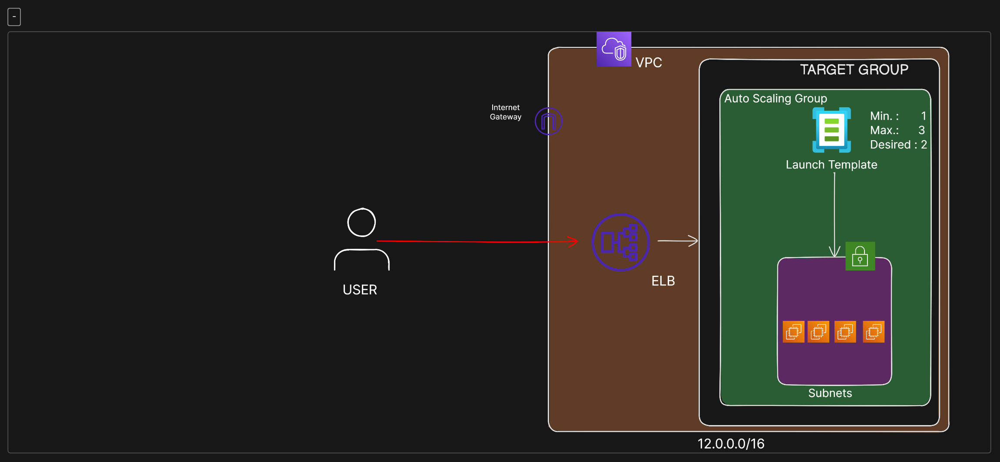
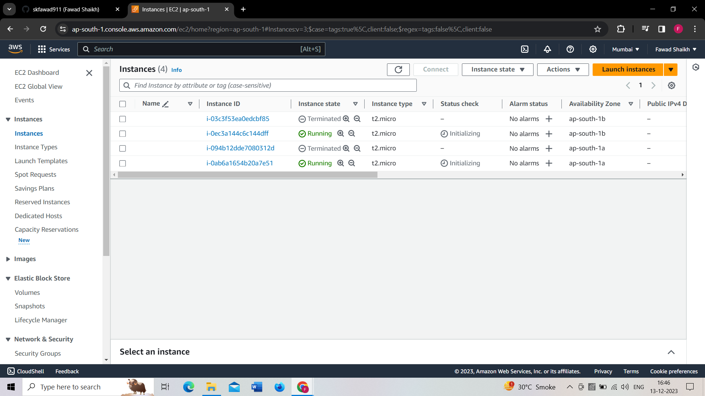

# AWS EC2 Auto Scaling Project

## Overview

This project showcases the implementation of AWS EC2 Auto Scaling using a Virtual Private Cloud (VPC), two public subnets, an Application Load Balancer (ALB), and a launch template. Auto Scaling ensures the desired number of EC2 instances are always available, providing scalability and reliability for your applications.

## Project Structure

The following components were created in this project:

### 1. Virtual Private Cloud (VPC)

- **Name:** test-vpc
- **IPv4 CIDR Block:** 12.0.0.0/16

### 2. Public Subnets

- **Subnet 1:** 
  - **CIDR Block:** 12.0.1.0/24
  - **Availability Zone:** Mumbai South AP 1a
- **Subnet 2:** 
  - **CIDR Block:** 12.0.3.0/24
  - **Availability Zone:** Mumbai South AP 1b

### 3. Internet Gateway

- Enables internet access for resources in the public subnets.

### 4. Route Table

- Associated with both public subnets.
- Routes traffic to the Internet Gateway for public access.

### 5. Application Load Balancer (ALB)

- Routes incoming traffic to EC2 instances.
- Linked to the VPC, public subnets, and a created security group.
- Handles traffic on HTTP port 80.

### 6. Target Group

- Includes both public subnets in the VPC.
- Configured with HTTP port 80.

### 7. EC2 Auto Scaling

- Utilizes a Launch Template (`lt-ec2-apache2-test`) for instance configurations.
- Launches instances with Auto Assign Public IP enabled.
- Auto Scaling Group ensures a desired number of instances are available.

## Auto Scaling Scenario

- The Auto Scaling Group automatically adjusts the number of instances based on the desired capacity.

- Even if instances are forcefully terminated, the Auto Scaling Group creates new instances to maintain the desired count.

## Conclusion
This project illustrates the power of Auto Scaling in AWS, ensuring your application is scalable, reliable, and able to handle varying loads.
